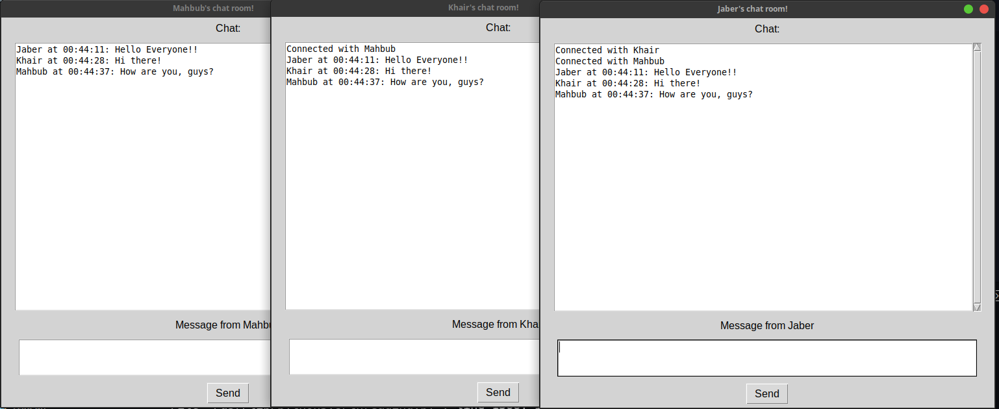

# Simple TCP socket based Desktop application 

**Description:** To set the communication up TCP socket programming is used in python. For Graphical User Interface(GUI); one of the popular library, `tkinter` is used.
****

## Setup Instruciton
Clone the repository using `git clone git@github.com:al-jaber-nishad/TalkyTCP.git`
### Server Setup
In the terminal run `python server.py`

### Client Setup
Run `python client.py` and give the nickname.

**HOLA!!** Its done!